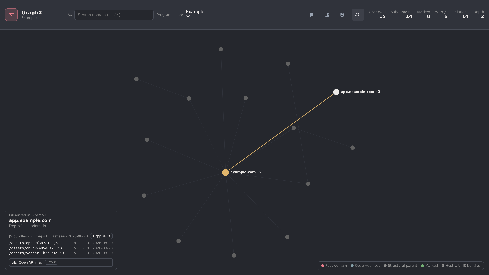

# GraphX

GraphX is a native Caido extension for exploring relationships in project data. It renders an interactive, full-page graph of every observed Sitemap domain that matches a selected Caido scope, with persistent domain marks, connection-path highlighting, and per-host JavaScript asset association.



## Features at a glance

- **Scope-wide domain graph** — every Sitemap domain in scope, laid out force-directed, with structural parent chains (`example.com` → `api.example.com`).
- **Persistent marks** — flag interesting domains (with or without their subdomain subtrees); marks survive restarts per project.
- **Connection paths** — highlight the full path between marked domains to see how surface connects.
- **JS asset awareness** — per-host bundle and source-map inventory from observed traffic, with first/last-seen timestamps.
- **API map drill-down** — a Swagger-like route map per host, built sitemap-first from your own traffic.
- **Search and keyboard-first navigation** — `/` or `Ctrl/Cmd+K` to jump to any domain.
- **Agent API** — read-only JSON on `127.0.0.1:8771` so automation can query the same estate model.
- **Passive** — GraphX never sends traffic to targets; it reads Caido's local data only.

## Current behavior

- Reads domain roots from Caido's local Sitemap API for the selected scope.
- Reapplies the scope allowlist and denylist before creating graph nodes.
- Normalizes and deduplicates hostnames.
- Creates immediate DNS-suffix relationships such as `example.com` → `stage.example.com` → `api.stage.example.com`.
- Adds a missing suffix only when that structural parent is itself in scope.
- Renders an Obsidian-style layout with Graphology and a ForceAtlas2 worker. It uses Sigma when WebGL is available and an interactive Canvas 2D renderer otherwise.
- Mirrors Caido's active light or dark mode across the page, controls, graph palette, and renderer without requiring a reload.
- Updates from Sitemap subscriptions, debounces bursts, and reconciles every five seconds while the GraphX page is active.
- Reconciles project and scope changes without retaining data from the previous project.
- Stops subscriptions, timers, layout workers, and rendering when the operator leaves GraphX, then resumes from a fresh project snapshot on return.
- Marks domains — alone or with their whole subdomain subtree — from a right-click context menu or the keyboard (`M` / `Shift+M`). Marks persist per Caido project in the plugin's SQLite database and render in a distinct marker color.
- Isolates marked domains with their ancestor chains via the **Marked only** toolbar toggle.
- Highlights the connection path between marked domains — the union of their ancestor chains, which is the unique minimal connector in this parent-domain forest — via the **Connection paths** toolbar toggle, muting everything else.
- Associates observed JavaScript bundles and source maps with each domain from local HTTP traffic (HTTPQL `req.path.like` sweep, grouped per host). The **JS assets** toggle mutes hosts without bundles and suffixes bundle counts onto labels; selecting a host lists its bundles with status, request count, map pairing, and a copy-URLs action.
- Searches domains and subdomains from the toolbar (`/` or `Ctrl/Cmd+K` to focus): ranked exact/prefix/substring matches in a live dropdown, and picking one selects the node and centers the camera on it.
- Drills into any domain's API map: `Enter` (or **Open API map**) swaps the canvas to a tree-laid-out route map of that host — segment trie with status-colored endpoints sized by traffic — from the same sitemap-first pipeline as the agent API's `/api-map`. `← Domains` or `Escape` returns.
- Sends no requests to target hosts.

An “observed host” means a domain root exists in the Caido Sitemap. A “structural parent” is an in-scope suffix derived only to preserve the relationship chain. Neither state currently means DNS-resolved or DNS-unresolved.

## Use in Caido

Install `dist/plugin_package.zip` from Caido's Plugins page, then select **GraphX** in the sidebar and choose a program scope. The graph always displays the complete scope at every depth. Use the toolbar search box (`/` or `Ctrl/Cmd+K`) to find any domain and jump to it. Drag nodes to pin the working layout, pan or zoom the canvas, and select a node to isolate its immediate neighborhood. Right-click the selected node (or press `M`; `Shift+M` includes its subdomains) to mark it — marks persist across restarts within the current project. The bookmark toolbar toggle shows only marked domains and their parent chains; the route toggle highlights the full connection path between marked domains; the file-code toggle fades hosts without observed JavaScript bundles and combines with the bookmark toggle into a joint emphasis. The graph is keyboard-focusable: use the arrow keys, Home/End, Escape, and `0` (fit view).

## Agent API

The backend plugin serves a read-only JSON API on `127.0.0.1:8771` (loopback only, no auth) so agents can query GraphX like they query Caido:

```bash
curl -s 127.0.0.1:8771/health                  # liveness + version
curl -s 127.0.0.1:8771/marks                   # project + marked hosts
curl -s "127.0.0.1:8771/domains?scope=Example" # full domain graph JSON
curl -s "127.0.0.1:8771/assets?scope=Example"  # per-host JS bundle/map groupings
curl -s "127.0.0.1:8771/brief?scope=Example"   # composite estate brief (session start)
curl -s "127.0.0.1:8771/api-map?host=api.example.com"  # per-host route map (Swagger-like templates)
```

`?scope=` takes a scope id or name and may be omitted when only one scope exists. All routes are GET + JSON; errors are `{ "error": string }`. See `docs/features/GX-DOM-007.md`.

## Development

The reproducible toolchain is pinned in `mise.toml`.

```bash
pnpm install --frozen-lockfile
pnpm typecheck
pnpm lint
pnpm knip
pnpm test
pnpm build
```

The workspace is split into three packages:

- `packages/shared`: pure scope, normalization, graph-domain types, and typed plugin contracts.
- `packages/backend`: Caido project context and project lifecycle events.
- `packages/frontend`: Caido adapters, orchestration composables, Vue components, and the replaceable graph renderer.

See `docs/architecture.md`, `docs/features/GX-DOM-001.md`, and `docs/features/GX-DOM-002.md` for the architecture and acceptance contracts.
